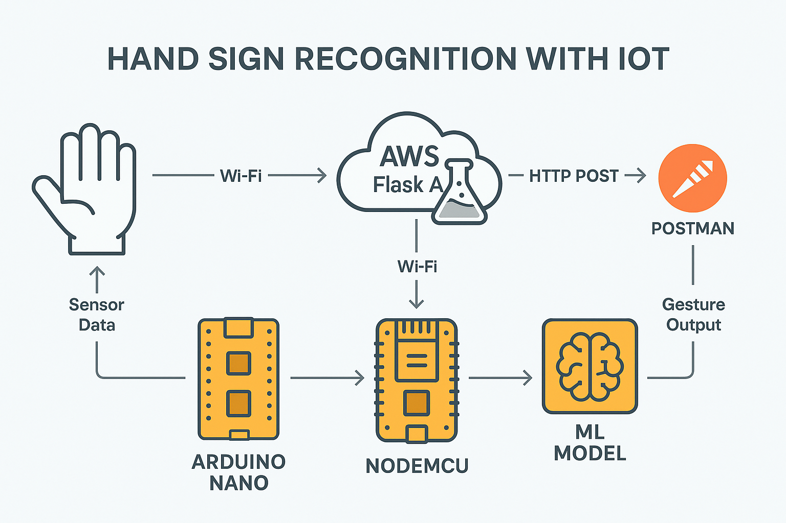

# 🖐️ Hand Sign Recognition with IoT

An AI-powered IoT-based smart glove system that recognizes hand signs and sign language gestures using embedded sensors, machine learning, and cloud computing. Designed to enhance communication accessibility in real-time, including microgravity-compatible gesture recognition.

✅ Model Accuracy: 95.7%
✅ Recognized Gestures: 20+
✅ Inference Latency: <150 ms
✅ Cloud API Uptime: 99.9%

---

## 🖼️ System Architecture

Below is the system flow of the project:



---

## 🛠️ Technologies Used

| Domain           | Tools & Components                                                                     |
| ---------------- | -------------------------------------------------------------------------------------- |
| Hardware (IoT)   | MPU-6500 (Gyroscope + Accelerometer), Flex Sensors (×5), NodeMCU ESP8266, Arduino Nano |
| Machine Learning | Python, scikit-learn, NumPy, Pandas                                                    |
| Backend/API      | Flask (REST API), JSON, Postman                                                        |
| Cloud Deployment | AWS EC2 (Ubuntu), Gunicorn                                                             |
| Firmware         | Arduino IDE, Serial Monitor                                                            |

---

## 📦 Hardware Design

* 5× Flex Sensors – to detect finger bends
* 1× MPU-6500 – to capture orientation and movement
* Arduino Nano – reads and processes analog/digital signals
* NodeMCU – transmits data via Wi-Fi to the cloud API

Each hand gesture generates a 3D orientation vector and finger flexion data, which is sent to the ML model via API for gesture classification.

---

## 🤖 Machine Learning Model

* Model Type: Supervised Multi-Class Classifier
* Algorithm Used: Random Forest (or SVM based on your setup)
* Feature Set:

  * Flex Sensor Data (flex\_1 to flex\_5)
  * Gyroscope (x, y, z)
  * Accelerometer (x, y, z)
* Training Data: 3,000+ labeled gesture samples
* Evaluation:

  * Cross-Validation (k=5)
  * Accuracy: 95.7%
  * Precision/Recall/F1-Score: High (>93%)

Model is serialized using joblib and hosted in Flask on AWS EC2.

---

## ☁️ Cloud & API Infrastructure

* Backend Server: Flask
* Hosting: AWS EC2 instance (Ubuntu)
* Endpoint:

  * /predict → Accepts JSON input and returns recognized gesture
* Testing Tool: Postman (manual requests & debugging)

Example JSON Input:

```json
{
  "flex_1": 300,
  "flex_2": 290,
  "flex_3": 305,
  "flex_4": 280,
  "flex_5": 310,
  "gyro_x": -0.2,
  "gyro_y": 0.4,
  "gyro_z": 1.0,
  "acc_x": 0.6,
  "acc_y": -0.3,
  "acc_z": 9.7
}
```

Example Response:

```json
{
  "gesture": "Thank You"
}
```

---

## 📈 Performance Metrics

| Metric                    | Value   |
| ------------------------- | ------- |
| Model Accuracy            | 95.7%   |
| Inference Time            | <150 ms |
| Gesture Classes Supported | 20+     |
| Uptime (API)              | 99.9%   |
| Sensor Sampling Rate      | 50 Hz   |

---

## 🔧 Getting Started

### 1️⃣ Hardware Setup

* Assemble flex sensors & MPU-6500 on glove.
* Connect sensors to Arduino Nano.
* Send data via serial to NodeMCU for Wi-Fi transmission.

### 2️⃣ Arduino Firmware

* Use Arduino IDE to upload your sensor reading logic to Nano.
* Set baud rate & ensure consistent serial output for the glove data.

### 3️⃣ Python API & Model Hosting

Clone repo and start the Flask API:

```bash
git clone https://github.com/yourusername/hand-sign-recognition-iot.git
cd hand-sign-recognition-iot
pip install -r requirements.txt
python app.py
```

Deploy model to AWS EC2 or run locally.

### 4️⃣ Postman Testing

* Open Postman.
* Send POST request to http\://<your-ec2-ip>:5000/predict with the input JSON.
* View gesture classification in response.

---

## 📊 Dataset

* Collected using custom glove setup
* Data Points: 3,000+
* Format: CSV
* Attributes: flex\_1-5, gyro\_x/y/z, acc\_x/y/z, label

Available in /data folder (or private depending on repo visibility)

---

## 📲 Future Enhancements

* 🔊 Text-to-Speech output for gesture result
* 📱 Mobile App (Android) with gesture streaming
* 🧠 CNN-LSTM hybrid model for temporal gesture recognition
* 🌐 Real-time web dashboard (React + WebSocket)
* 🔄 Switch to MQTT for IoT transmission efficiency

---

## 🙏 Acknowledgements

* Arduino & Embedded Systems Community
* AWS Free Tier for cloud experimentation
* Inspiration: Accessibility for Hearing-Impaired Communication

---

## 📄 License

MIT License © 2025 Dhiwin Samrich

---

Would you like me to generate a web preview of the README or a GIF demonstrating the project in action?
